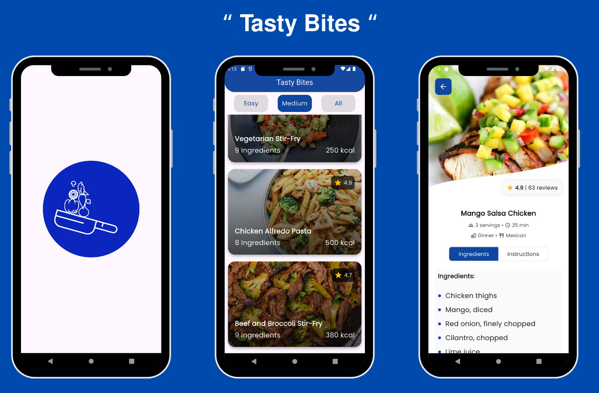

# Tasty Bites 🍽️

Tasty Bites is a Flutter mobile application that helps users explore a variety of delicious recipes filtered by difficulty level (Easy, Medium, All). Each recipe includes detailed information such as ingredients, step-by-step instructions, cooking time, meal type, cuisine, and more.

<p align="center">
  
</p>

## 🔧 Built With

- **Flutter**
- **Cubit (Bloc for state management)**
- **Public Recipe API**

## ✨ Features

- Splash screen animation on app launch
- Browse recipes filtered by difficulty (Easy, Medium, All)
- View full recipe details:
  - Ingredients list
  - Step-by-step instructions
  - Cooking time
  - Cuisine type
  - Meal type (e.g., breakfast, lunch)
- Smooth and responsive UI using Flutter
- Built using Cubit for efficient state management

## 📸 App Preview

<p align="center">
  
</p>

## 📁 Project Structure Highlights

- `cubits/recipe_cubit.dart` – Manages recipe fetching logic and state
- `models/recipe_model.dart` – Data model for the recipe
- `views/` – UI screens (HomeView, SplashView, RecipeDetailView)
- `widgets/` – Reusable UI components like RecipeCard, Classification Tabs, InfoRow, etc.

## 📦 Getting Started

To run the project locally:

```bash
git clone https://github.com/rababhamdyy/tasty_bites_app.git
cd tasty_bites_app
flutter pub get
flutter run
